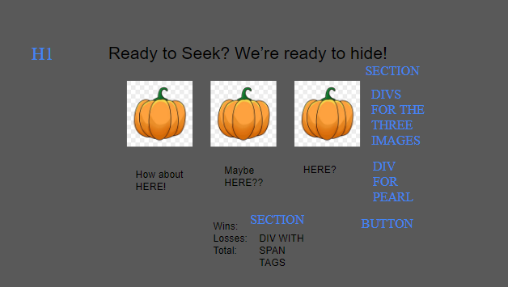

# FROM SCRATCH Spooky Hide N Seek

## STATE

-   Total guesses
-   Number of correct guesses
-   Number of Incorrect Guesses

## EVENTS

-   Seek button(s)

1. total is incremented
2. randomly generates spot for the ghost to hide
3. add reveal class to generated spot
4. checks to see if user matches correct hiding spot
5. Removes the reveal class on the shells
